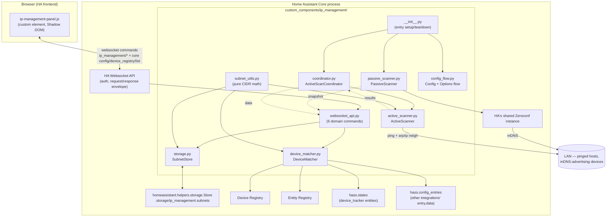

# System Overview

## What this is

IP Management is a Home Assistant **custom integration** — it does not run
as a standalone process. It loads inside HA Core's own Python process when
a user adds it via Settings → Devices & Services, and it renders its UI as
a **custom sidebar panel** (a hand-written web component) served by HA's
own frontend HTTP server. There is no separate backend server, database, or
build step: persistence is HA's `Store` helper (JSON on disk under
`.storage/`), and the "API" is a set of HA websocket commands, not REST.

## Runtime placement

## Module responsibilities

| Module | Responsibility | Depends on HA? |
|---|---|---|
| `subnet_utils.py` | CIDR parsing, nesting inference, display-range formatting | No — pure `ipaddress` |
| `storage.py` (`SubnetStore`) | CRUD for subnets + two manual-override maps; recomputes hierarchy on every write | Yes (`Store` helper) |
| `device_matcher.py` (`DeviceMatcher`) | Resolves device→IP candidates, matches IPs to subnets, applies manual overrides | Yes (device/entity registry, states, config entries) |
| `active_scanner.py` (`ActiveScanner`) | Ping-sweeps opted-in subnets, correlates responses to MACs via ARP/neighbor table | Only for `hass` injection; scanning itself shells out to OS `ping`/`arp` |
| `passive_scanner.py` (`PassiveScanner`) | Listens to HA's shared Zeroconf instance for mDNS announcements | Yes (shared zeroconf) |
| `coordinator.py` (`ActiveScanCoordinator`) | Schedules `ActiveScanner.async_scan` on a timer, caches latest result | Yes (`DataUpdateCoordinator`) |
| `websocket_api.py` | Exposes 6 domain websocket commands; merges device_tracker/config_entry/scan/manual sources for the device list | Yes (`websocket_api` decorators) |
| `config_flow.py` | Zero-field setup flow (just makes the integration installable) + options flow for discovery toggles/interval | Yes (`config_entries`) |
| `__init__.py` | Wires everything into `hass.data[DOMAIN]`, registers websocket commands, static path, and the sidebar panel | Yes |
| `www/ip-management-panel.js` | Frontend custom element: dashboard + subnet-management views, assign-device dialog | No (browser-side only) |

## Design principles that show up repeatedly

- **Nesting is always derived, never stored as input.** `subnet_utils.infer_parent_ids`
  recomputes every subnet's `parent_id` from CIDR containment on *every*
  save/delete — see [Data Model](02-data-model.md).
- **Automatic discovery only ever fills gaps.** Active scan and passive
  mDNS results are folded into the device list with `dict.setdefault`,
  after device_tracker/config_entry — see [Sequence Diagrams](03-sequence-diagrams.md).
  Manual assignment is the one thing allowed to override anything, and it's
  applied last.
- **Everything optional is off by default and independently scoped.** Active
  scanning needs both the options-flow toggle *and* a per-subnet opt-in;
  passive discovery has no scope at all (it only listens).
- **No REST, no custom HTTP endpoints beyond the static panel bundle.** All
  data flows over HA's own websocket connection, reusing its auth.
