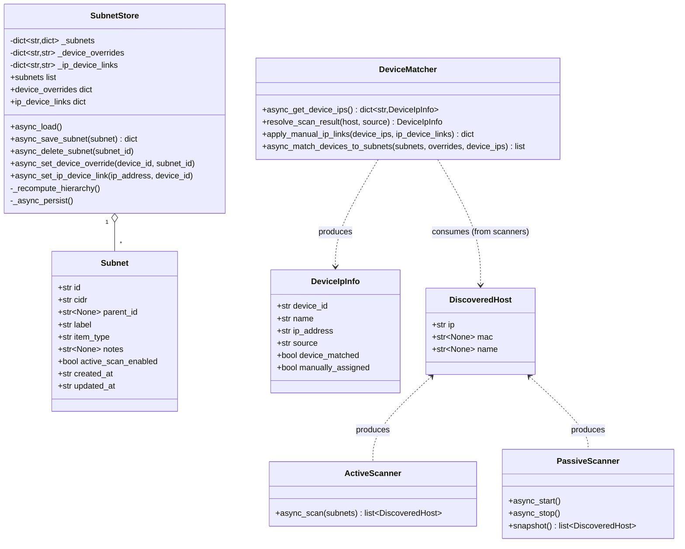
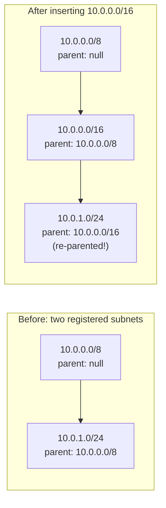

# Data Model

## Persisted shape

Everything lives in one HA `Store` file, `.storage/ip_management.subnets`
(`storage.py`, `STORAGE_KEY = "ip_management.subnets"`, `STORAGE_VERSION = 1`):

```json
{
  "subnets": [
    {
      "id": "uuid",
      "cidr": "192.168.10.0/24",
      "parent_id": "uuid | null",
      "label": "Cameras",
      "item_type": "IoT",
      "notes": "string | null",
      "active_scan_enabled": false,
      "created_at": "iso8601",
      "updated_at": "iso8601"
    }
  ],
  "device_overrides": { "device_id": "subnet_id" },
  "ip_device_links": { "ip_address": "device_id" }
}
```

`SubnetStore` loads this once into three in-memory structures
(`_subnets`, `_device_overrides`, `_ip_device_links`) and persists the
whole file back on every mutating call — there's no per-record partial
write.

## Class / type diagram



`DeviceIpInfo` and `Subnet` never nest inside each other on disk — the
relationship is always computed at read time (`subnet_id` is attached
per-device in the *response* to `ip_management/devices/list`, not stored).

## Two easily-confused override maps

| Map | Key → Value | Set by | Meaning |
|---|---|---|---|
| `device_overrides` | `device_id → subnet_id` | `ip_management/devices/set_override` | Force a *known device* into a specific *subnet*, bypassing IP-based matching entirely. |
| `ip_device_links` | `ip_address → device_id` | `ip_management/devices/assign_ip` | Force a specific *IP* to be attributed to a *device*, regardless of what device_tracker/config_entry/scan found. |

They're keyed in opposite directions on purpose: pick whichever one matches
the entity you already have in hand. `device_overrides` short-circuits
subnet matching in `async_match_devices_to_subnets`; `ip_device_links` is
applied earlier, in `apply_manual_ip_links`, before subnet matching even
runs — see [Sequence Diagrams](03-sequence-diagrams.md) for how the two
interact in `ws_list_devices`.

## Subnet hierarchy inference

`parent_id` is **never** user input — `subnet_utils.infer_parent_ids`
recomputes it for *every* subnet on every save/delete:

> each subnet's parent = the most specific *other* subnet that strictly
> contains it (smallest qualifying supernet wins); no containing subnet ⇒
> `parent_id = null` (top level).



The newly inserted `/16` strictly contains the existing `/24` child and is
itself strictly contained by the `/8`, so it becomes the smallest
container available for the child — recomputing from scratch finds it
automatically. The rule (smallest strictly-containing *other* subnet wins)
is recomputed for every subnet on every save/delete, so insertion order
never matters and deletions correctly re-parent orphaned children to
whatever now most-specifically contains them.

## Display-only derived fields

Computed on read in `subnet_utils.py`, never persisted:

- **`display_range`** — last-octet range (`.0-.255`) for prefix ≥ 24;
  full first/last host string for shorter prefixes where a single octet
  range would be misleading.
- **Depth / tree path** — derived client-side (and in tests) by walking
  `parent_id` chains; not stored as a field.
