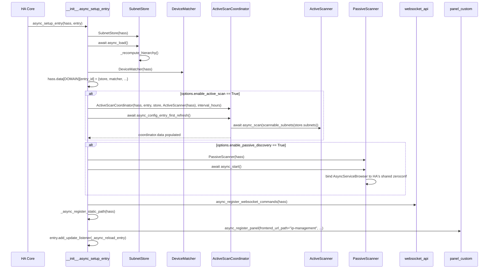
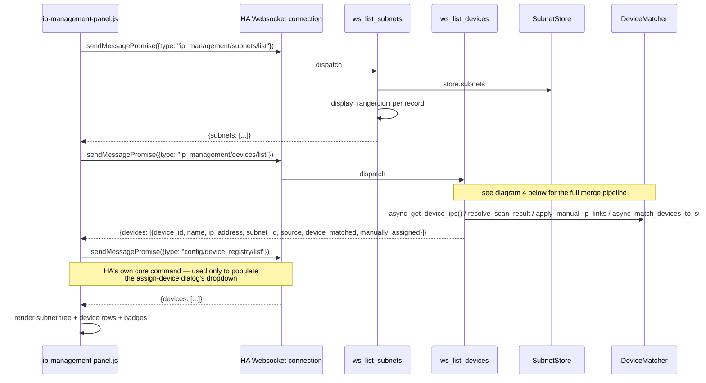
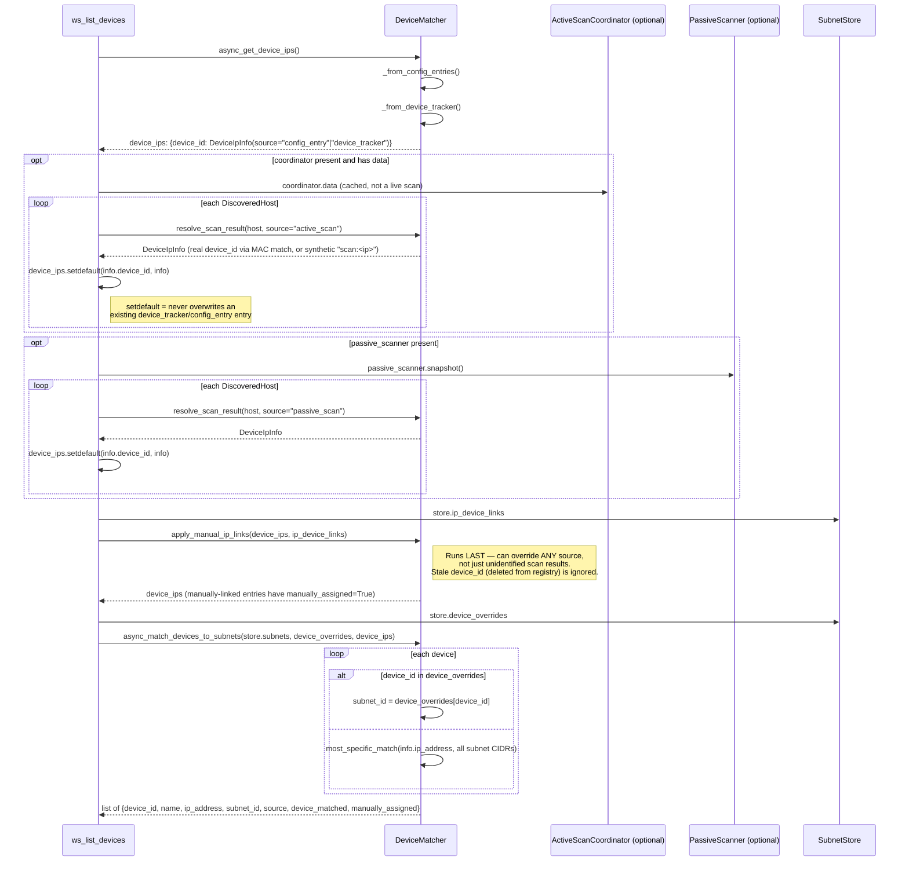
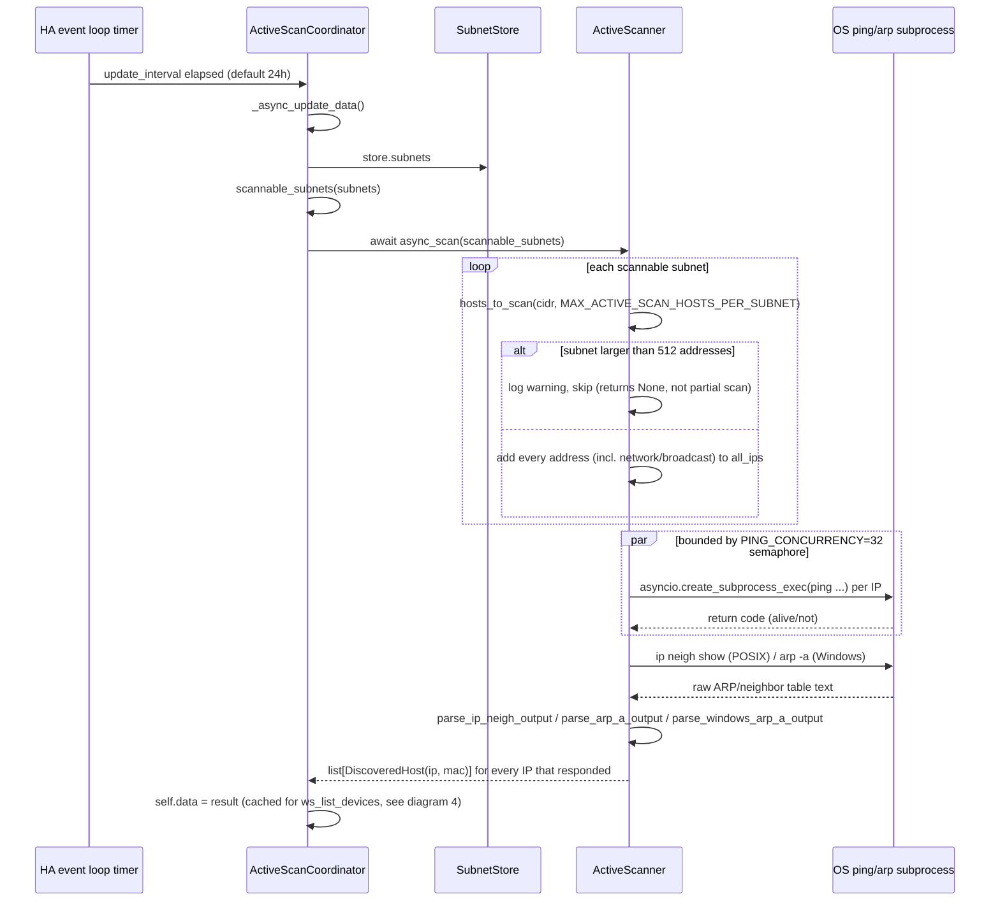
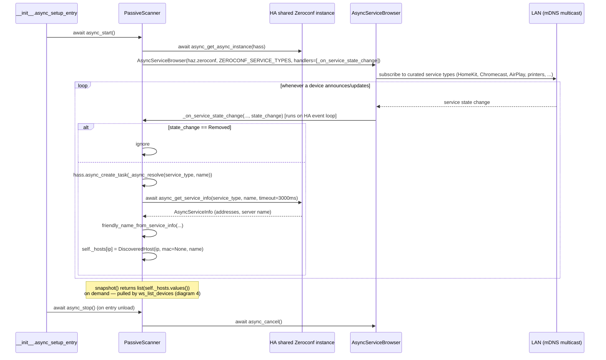

# Sequence Diagrams

## 1. Integration setup (`async_setup_entry`)

Runs once when HA loads the config entry (on HA startup, or right after the
user adds/reloads the integration).



Teardown (`async_unload_entry`) is the mirror image: pop `hass.data[DOMAIN][entry_id]`,
`await coordinator.async_shutdown()` if present, `await passive_scanner.async_stop()`
if present. Changing options (Configure dialog) always triggers a full
`hass.config_entries.async_reload` rather than live-mutating a running
coordinator/scanner.

## 2. Dashboard load (subnets + devices)

What happens when the panel's dashboard view opens or refreshes.



## 3. Save a subnet (create/edit) — hierarchy recompute

```mermaid
sequenceDiagram
    participant Panel as ip-management-panel.js
    participant WS as HA Websocket connection
    participant Cmd as ws_save_subnet
    participant Store as SubnetStore
    participant Utils as subnet_utils

    Panel->>WS: sendMessagePromise({type: "ip_management/subnets/save", subnet_id?, cidr, label, item_type, notes, active_scan_enabled})
    WS->>Cmd: dispatch (msg["id"] is the websocket envelope id — NOT subnet_id)
    Cmd->>Cmd: payload = msg minus "type"/"id"; rename subnet_id -> id
    Cmd->>Store: await async_save_subnet(payload)
    Store->>Utils: parse_network(cidr)
    alt invalid CIDR
        Utils-->>Store: raise InvalidCidrError
        Store-->>Cmd: propagate
        Cmd-->>Panel: send_error(msg["id"], "invalid_subnet", ...)
    else valid CIDR
        Store->>Store: merge into _subnets[id] (preserve created_at)
        Store->>Store: _recompute_hierarchy()
        Store->>Utils: infer_parent_ids(all cidrs)
        Utils-->>Store: {subnet_id: parent_id, ...} for every subnet
        Store->>Store: await _async_persist()  # whole file rewritten
        Store-->>Cmd: saved record
        Cmd->>Utils: display_range(record["cidr"])
        Cmd-->>Panel: send_result(msg["id"], {subnet: record})
    end
    Panel->>Panel: reload subnet list, re-render tree
```

## 4. List devices — the source-merge pipeline (`ws_list_devices`)

This is the most order-sensitive flow in the codebase: each source can only
*fill gaps*, except the manual IP link step, which runs last and can
override anything.



## 5. Manually assigning a device to an IP (assign-device dialog)

```mermaid
sequenceDiagram
    actor User
    participant Panel as ip-management-panel.js
    participant WS as HA Websocket connection
    participant Cmd as ws_assign_ip_device
    participant Store as SubnetStore

    User->>Panel: click a device row's IP address (.device-ip[data-open-assign])
    Panel->>Panel: lookup device by IP in this._devices
    Panel->>Panel: _openAssignDialog(device) -> this._assigningDevice = device; re-render
    Panel->>Panel: render <select> pre-selected to device.device_id if manually_assigned else "" (Automatic)
    Note over Panel: options come from this._haDevices,<br/>fetched once via core config/device_registry/list

    User->>Panel: pick a device (or "Automatic") and Save
    Panel->>Panel: deviceId = select.value || null
    Panel->>WS: sendMessagePromise({type: "ip_management/devices/assign_ip", ip_address, device_id: deviceId})
    WS->>Cmd: dispatch
    Cmd->>Store: await async_set_ip_device_link(ip_address, device_id)
    alt device_id is None
        Store->>Store: _ip_device_links.pop(ip_address, None)
    else
        Store->>Store: _ip_device_links[ip_address] = device_id
    end
    Store->>Store: await _async_persist()
    Cmd-->>Panel: send_result(msg["id"], {})
    Panel->>Panel: close dialog, reload devices list (diagram 4 re-runs, now with the new link)
```

Clicking the dialog's Cancel button, or the `.dialog-overlay` background
(but not the `.dialog-box` itself), closes the dialog without calling
`assign_ip` at all.

## 6. Active scan cycle (coordinator-driven)



## 7. Passive discovery (mDNS) lifecycle


