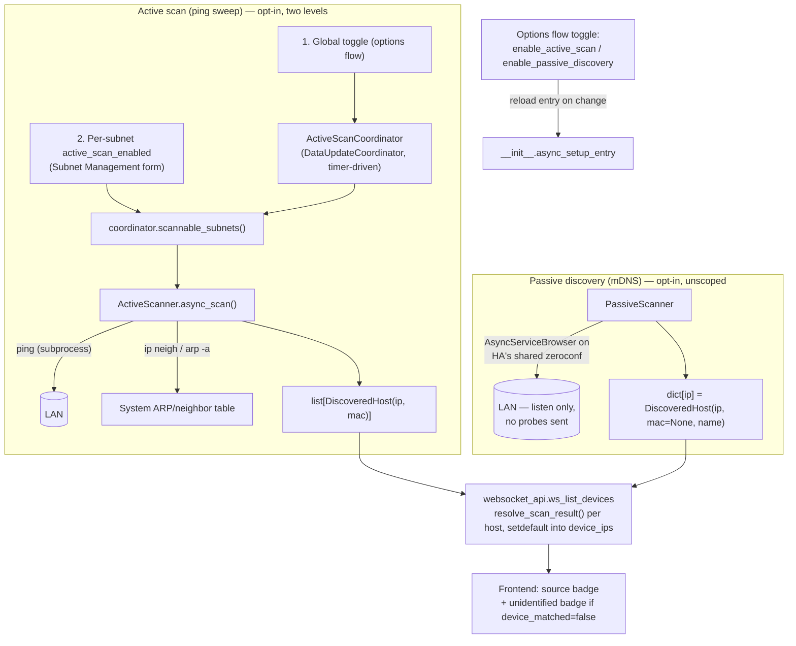

# Discovery Subsystem

Both features are **optional, off by default**, toggled only via the
config entry's options flow (`config_flow.IPManagementOptionsFlow` —
Settings → Devices & Services → IP Management → Configure). Neither is
configurable from the custom panel itself.

## Active scan — key constraints

| Constraint | Where enforced | Why |
|---|---|---|
| Scope = only subnets registered *and* individually opted in | `coordinator.scannable_subnets()` | Global toggle ≠ "scan everything"; lets a user restrict scanning to e.g. just an IoT subnet. |
| Max 512 addresses per subnet | `active_scanner.hosts_to_scan` via `MAX_ACTIVE_SCAN_HOSTS_PER_SUBNET` | A mistakenly huge CIDR (e.g. `/8`) is skipped-and-logged, not partially scanned or flooded. |
| Includes network/broadcast addresses | `hosts_to_scan` iterates the full `IPv4Network`, not `.hosts()` | Subnets here are arbitrary ranges, not classful networks; `display_range` already shows those addresses as part of the subnet to the user. |
| No raw ICMP sockets | `asyncio.create_subprocess_exec` to the OS `ping` binary | HA OS/Supervised containers generally don't grant `CAP_NET_RAW` to custom integrations. |
| Bounded concurrency | `asyncio.Semaphore(PING_CONCURRENCY=32)` | Caps simultaneous ping subprocesses regardless of subnet size. |
| Default interval | `ActiveScanCoordinator(update_interval=timedelta(hours=interval_hours))`, default 24h | Configurable 1–720h via the options flow schema. |

## Passive discovery — key constraints

| Constraint | Where enforced | Why |
|---|---|---|
| Uses HA's own shared zeroconf instance | `ha_zeroconf.async_get_async_instance(hass)` | Avoids opening a second mDNS engine / duplicating HA's own multicast traffic. |
| Direct `AsyncServiceBrowser`, not the convenience wrapper | `passive_scanner.py` | The shared instance's `async_add_service_listener` keys its internal tracking dict by listener object; reusing one listener across multiple curated service types would silently drop all but the last browser reference on cleanup. |
| Curated service-type list only | `const.ZEROCONF_SERVICE_TYPES` | Not a full dynamic `_services._dns-sd._udp` enumeration — deemed unnecessary complexity for v1; devices that don't advertise under one of these are invisible to it. |
| No host-count cap, no subnet scoping | n/a — it only listens | There's no outbound traffic to bound, unlike active scan. |
| Callbacks run on the HA event loop already | Verified against installed `zeroconf` library source | `_on_service_state_change` can call `hass.async_create_task(...)` directly, no `call_soon_threadsafe` needed. |

## Feeding back into device matching

Both scanners produce the same shared type, `device_matcher.DiscoveredHost(ip, mac, name)`,
deliberately independent of HA's device/entity registries — neither
scanner needs to know how to resolve a device. The translation happens in
one place: `DeviceMatcher.resolve_scan_result(host, source)`:

- MAC matches an existing device registry connection (`dr.CONNECTION_NETWORK_MAC`)
  → attributed to that real device, `device_matched=True` (merges with,
  never duplicates, anything device_tracker/config_entry already resolved
  for it, thanks to `setdefault` in `ws_list_devices`).
- No MAC match (including passive discovery, which never has a MAC) →
  synthetic `device_id = f"scan:{ip}"`, `device_matched=False`. This is
  exactly the condition the frontend's "unidentified" badge keys off of.

See [Sequence Diagrams §4 and §6/§7](03-sequence-diagrams.md) for the full
call sequence, and [Data Model](02-data-model.md) for how a manual
`ip_device_links` entry can later correct a `scan:<ip>` row to a real
device.
