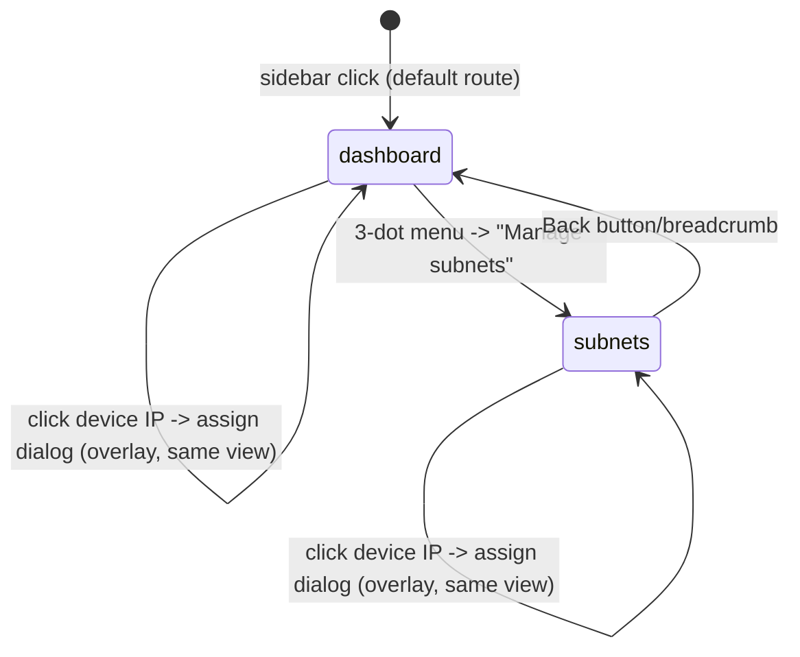
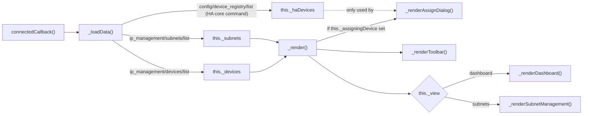

# Frontend Panel Architecture

`custom_components/ip_management/www/ip-management-panel.js` is a single,
hand-written, dependency-free `HTMLElement` (`IPManagementPanel`) using
Shadow DOM — deliberately not `LitElement`, so there's no build step
(esbuild/npm) for what is two views and a handful of components. It ships
as-is and is registered via `customElements.define("ip-management-panel", ...)`.

## Component / state structure

```mermaid
classDiagram
    class IPManagementPanel {
        -string _view
        -Array _subnets
        -Array _devices
        -Array _haDevices
        -Object _assigningDevice
        -Object _hass
        +connectedCallback()
        -_loadData() async
        -_render()
        -_renderToolbar(title, opts)
        -_renderDashboard()
        -_renderSubnetManagement()
        -_renderAssignDialog()
        -_openAssignDialog(device)
        -_closeAssignDialog()
        -_assignIpDevice(ip, deviceId) async
        -_saveSubnet(payload) async
        -_deleteSubnet(id) async
    }
    IPManagementPanel --> "HA websocket connection" : this._hass.connection.sendMessagePromise
```

Everything is one custom element with **internal routing** (`this._view`,
either `"dashboard"` or `"subnets"`) — there is no second sidebar entry and
no HA-router navigation involved in switching between the dashboard and
subnet management.



## Badge helpers (rendered per device row, in both places rows appear)

| Helper | Style | Renders when |
|---|---|---|
| `sourceBadge(d.source)` | neutral | Always — shows tracker/config/active scan/mDNS |
| `unidentifiedDeviceBadge(d)` | warning | `d.device_matched === false` |
| `manuallyAssignedBadge(d)` | info | `d.manually_assigned === true` |
| `activeScanBadge(subnet)` | neutral | `subnet.active_scan_enabled === true` |

All three device badges appear together on every device row, in **both**
the per-subnet device list and the "Unmatched devices" section — a rule
worth re-checking any time that markup is touched, since it's easy to add
one badge helper call without the others.

## Data flow: load → render



`this._haDevices` is fetched purely to populate the assign-device dialog's
`<select>` — there is no custom backend endpoint for "list HA devices"
because the frontend calls HA's own core `config/device_registry/list`
websocket command directly instead of duplicating that data through a
custom one.

## Assign-device dialog specifics

- Every device row's IP (`.device-ip[data-open-assign="<ip>"]`) is
  clickable unconditionally — not gated on `device_matched` or
  `manually_assigned` — because manual assignment must work on *any* row.
- Clicking looks the device up in `this._devices` by IP (`_openAssignDialog`),
  setting `this._assigningDevice` and triggering a re-render; `_render()`
  appends `_renderAssignDialog()`'s markup (`.dialog-overlay` + `.dialog-box`)
  after the normal view whenever that field is set.
- The `<select>` is pre-selected to `device.device_id` only if
  `device.manually_assigned` is true, otherwise to the empty-string
  "Automatic" option — this is why the dialog needs the full device object
  from `this._devices`, not just the IP string.
- Save reads the select's value (empty string ⇒ `null`), calls
  `_assignIpDevice(ip, deviceId)` → `ip_management/devices/assign_ip` →
  reloads data. Cancel and clicking the `.dialog-overlay` background (but
  not the `.dialog-box` itself) both close without saving.

## Outgoing message conventions

- Save/delete subnet messages use the field name `subnet_id`, never `id` —
  every HA websocket envelope already reserves `id` for request/response
  correlation, and the backend (`ws_save_subnet`/`ws_delete_subnet`)
  translates `subnet_id` → `id` internally. This convention must be
  preserved in any new command added to either side.
- The add/edit subnet form has **no parent-subnet field** by design;
  nesting is always inferred server-side from the CIDR (see
  [Data Model](02-data-model.md)).

See [Sequence Diagrams §2 and §5](03-sequence-diagrams.md) for the full
message exchanges this panel drives.
